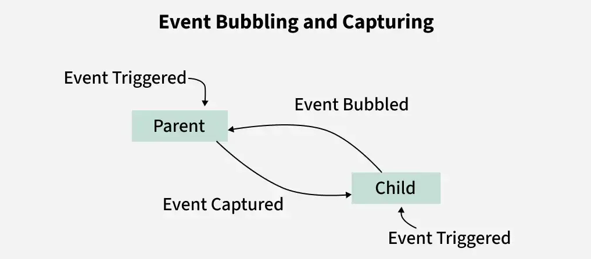

### 1. What is the difference between getElementById, getElementsByClassName, and querySelector / querySelectorAll?
The key differences between getElementById, getElementsByClassName, and querySelector/querySelectorAll lie in their selection criteria, return types, and whether they return "live" or "static" collections.
## Selection Criteria:
-getElementById(id): Selects a single element based on its unique id attribute. IDs in HTML should be unique.
-getElementsByClassName(className): Selects all elements that possess a specific class name.
-querySelector(selector): Selects the first element that matches a specified CSS selector. This allows for selection by ID (#id), class (.class), tag name (tag), or any other valid CSS selector combination. 
-querySelectorAll(selector): Selects all elements that match a specified CSS selector.
## Return Type:
-getElementById: Returns a single Element object if found, otherwise null.
-getElementsByClassName: Returns an HTMLCollection, which is an array-like object of elements.
-querySelector: Returns a single Element object if found, otherwise null.
-querySelectorAll: Returns a NodeList, which is an array-like object of elements.
## "Live" vs. "Static" Collections:
-getElementsByClassName:Returns a live HTMLCollection. This means the collection automatically updates if elements matching the criteria are added or removed from the DOM after the collection is retrieved.
-querySelectorAll:Returns a static NodeList. This means the collection is a snapshot of the DOM at the time of retrieval and will not automatically update if the DOM changes later.

---

### 2. How do you create and insert a new element into the DOM?
Creating and inserting a new element into the Document Object Model (DOM) typically involves two main steps: creating the element and then appending or inserting it into an existing part of the document.
-1. Creating the Element:
Use `document.createElement()`

-2. Inserting the Element into the DOM:
const newDiv = document.createElement("div");
newDiv.textContent = "Hello World";
document.body.appendChild(newDiv);

### 3.What is Event Bubbling and how does it work?

Event bubbling in JavaScript is a mechanism where an event triggered on a child element propagates upward through its ancestors in the DOM. It allows parent elements to respond to events triggered by their child elements.

-Propagation Direction: In event bubbling, the event starts at the target element and propagates upward through its -parent elements to the root of the DOM.
-Default Behavior: Event bubbling is enabled by default in JavaScript.
-Event Listeners: If multiple event listeners are attached in the bubbling phase, they are executed in sequence, starting from the innermost target element.
---
## The way Event Bubbling works:
-Event Triggering: The click event is triggered on the child element (button), initiating the event propagation.
-Event Capturing: In the capturing phase, the event propagates from the root of the DOM down to the target (child). However, no listeners are explicitly set to handle events in this phase in the given code.
-Event Bubbling: After reaching the target element (child), the event enters the bubbling phase, propagating back up through the DOM tree to the parent (parent).
-Listener Behavior: Event listeners are attached to both parent and child elements using addEventListener. By default, these listeners respond during the bubbling phase unless the capture option is set to true.
-Execution Order: When the button is clicked, the child listener executes first (console.log("Child")), followed by the parent listener (console.log("Parent")) as the event bubbles up.

### 4.What is Event Delegation in JavaScript? Why is it useful??
Event Delegation is basically a pattern to handle events efficiently. Instead of adding an event listener to each and every similar element, we can add an event listener to a parent element and call an event on a particular target using the .target property of the event object.
# This is useful because it
-Attach one event to a parent and use bubbling to “catch” events from children.
-Saves memory, fewer listeners, works with dynamic elements.

---

### 5. What is the difference between preventDefault() and stopPropagation() methods?
-preventDefault() → stops the default action of an element (e.g., prevents a form from submitting, prevents a link from navigating).

-stopPropagation() → stops the event from bubbling up to parent elements.

# Example: On a link inside a 
:

-preventDefault() stops the link from opening.

-stopPropagation() stops the click from reaching the 
’s handler.
---

